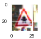

#**Traffic Sign Recognition**

**Build a Traffic Sign Recognition Project**

The goals / steps of this project are the following:
* Load the data set (see below for links to the project data set)
* Explore, summarize and visualize the data set
* Design, train and test a model architecture
* Use the model to make predictions on new images
* Analyze the softmax probabilities of the new images
* Summarize the results with a written report

[//]: # (Image References)

[image1]: ./examples/visualization.jpg "Visualization"
[image2]: ./examples/grayscale.jpg "Grayscaling"
[image3]: ./examples/random_noise.jpg "Random Noise"
[image4]: ./examples/placeholder.png "Traffic Sign 1"
[image5]: ./examples/placeholder.png "Traffic Sign 2"
[image6]: ./examples/placeholder.png "Traffic Sign 3"
[image7]: ./examples/placeholder.png "Traffic Sign 4"
[image8]: ./examples/placeholder.png "Traffic Sign 5"

## Rubric Points
###Here I will consider the [rubric points](https://review.udacity.com/#!/rubrics/481/view) individually and describe how I addressed each point in my implementation.  

---
###Writeup / README

####1. Provide a Writeup / README that includes all the rubric points and how you addressed each one. You can submit your writeup as markdown or pdf. You can use this template as a guide for writing the report. The submission includes the project code.

You're reading it! and here is a link to my [project code](https://github.com/aman-ahluwalia/CarND-Traffic-Sign-Classifier/blob/master/Traffic_Sign_Classifier.ipynb)

###Data Set Summary & Exploration

####1. Provide a basic summary of the data set. In the code, the analysis should be done using python, numpy and/or pandas methods rather than hardcoding results manually.

I used the basic python to calculate summary statistics of the traffic
signs data set:

* The size of training set is 34799
* The size of the validation set is 4410
* The size of test set is 12630
* The shape of a traffic sign image is (32, 32, 3)
* The number of unique classes/labels in the data set is 32

####2. Include an exploratory visualization of the dataset.

Here is an exploratory visualization of the data set. It is a bar chart plotting the count of each sign.

[visualization](https://github.com/aman-ahluwalia/CarND-Traffic-Sign-Classifier/blob/master/report_images/exploration_graph.jpg)

###Design and Test a Model Architecture

####1. Describe how you preprocessed the image data. What techniques were chosen and why did you choose these techniques? Consider including images showing the output of each preprocessing technique. Pre-processing refers to techniques such as converting to grayscale, normalization, etc. (OPTIONAL: As described in the "Stand Out Suggestions" part of the rubric, if you generated additional data for training, describe why you decided to generate additional data, how you generated the data, and provide example images of the additional data. Then describe the characteristics of the augmented training set like number of images in the set, number of images for each class, etc.)

As a first step, I decided to convert the images to grayscale as there were theoretical and practical reasons. If we look bluntly
the colored images should give more accuracy as in greyscale the arroys won't be clearly visible also, but practically when i tested
the result was opposite. Non-normalized color yielded overall worse performance. Plus wide array lighting conditions  makes color in general unreliable. The greyscale tend to work better when tested practically.

Here is an example of a traffic sign image before and after grayscaling.

[before scaling](https://github.com/aman-ahluwalia/CarND-Traffic-Sign-Classifier/blob/master/report_images/before.jpg)

[greyscale](https://github.com/aman-ahluwalia/CarND-Traffic-Sign-Classifier/blob/master/report_images/greyscale.jpg)

As a last step, I normalized the image data in order to reduce the noise and bring all the features in the same proportion, to provide equal importance to all.

I decided to generate additional data (but did not use it in the final model) because i though that would provide different aspects as covered by conv nets plus increase the data space, but turned out to be no benefit for me, the accuracy remained almost the same. I t

To add more data to the the data set, I used the rotation, shear and translation.

Here is an example of an original image and an augmented image:

[original image](https://github.com/aman-ahluwalia/CarND-Traffic-Sign-Classifier/blob/master/report_images/before.jpg)

[augmented image](https://github.com/aman-ahluwalia/CarND-Traffic-Sign-Classifier/blob/master/report_images/after_scaling.jpg)

But i did not use the the augmented data set, as it didn't helped in increasing the accuracy to a great extent.

####2. Describe what your final model architecture looks like including model type, layers, layer sizes, connectivity, etc.) Consider including a diagram and/or table describing the final model.

My final model consisted of the following layers:

| Layer         		|     Description	        					|
|:---------------------:|:---------------------------------------------:|
| Input         		| 32x32x1 greyscale image   							|
| Convolution 5x5     	| 1x1 stride, same padding, outputs 28x28x6 	|
| RELU					|												|
| Max pooling	      	| 2x2 stride,  outputs 14x14x6 				|
| Convolution 5x5	    | 1x1 stride, same padding, outputs 10*10*16      									|
| RELU					|												|
| Max pooling	      	| 2x2 stride,  outputs 5x5x16 				|
| Flatten      	| Input = 5x5x16 (conv2) and 14x14x6 (conv1),  outputs 1576 				|
| dropout					|	probability = 0.7											|
| Fully connected		| Input = 1576, Output = 120       									|
| RELU					|												|
| dropout					|	probability = 0.7											|
| Fully connected		| Input = 120, Output = 84       									|
| RELU					|												|
| dropout					|	probability = 0.7											|
| Fully connected		| Input = 84, Output = 10       									|

####3. Describe how you trained your model. The discussion can include the type of optimizer, the batch size, number of epochs and any hyperparameters such as learning rate.

To train the model, I used an the batch_size of 128, number of epochs to 16 and standard learning rate of 0.001, plus the keep probability of .7 for dropouts. I have used an Adam Optimizer. Have used cross entropy and reduce mean to get the accurate results.

####4. Describe the approach taken for finding a solution and getting the validation set accuracy to be at least 0.93. Include in the discussion the results on the training, validation and test sets and where in the code these were calculated. Your approach may have been an iterative process, in which case, outline the steps you took to get to the final solution and why you chose those steps. Perhaps your solution involved an already well known implementation or architecture. In this case, discuss why you think the architecture is suitable for the current problem.

My final model results were:
* training set accuracy of .992
* validation set accuracy of .955
* test set accuracy of 0.932

If a well known architecture was chosen:
* What architecture was chosen?
I used a 2-stage ConvNet architecture. The input is processed in a feed forward manner through two stage of convolutions and subsampling, and finally classified with a linear classifier. The output of the 1st stage is also fed directly to the classifier as higher-resolution features. Though i have included some dropouts in between to reduce the chances of overfitting. The primary idea of dropout is to randomly drop components of neural network (outputs) from a layer of neural network. This results in a scenario where at each layer more neurons are forced to learn the multiple characteristics of the neural network.
* Why did you believe it would be relevant to the traffic sign application?
 Firstly it is based on traditional convnets like lenet (which were very accurate in tasks like the present one), but with few modifications. Usual ConvNets are organized in strict feed-forward layered architectures in which the output of one layer is fed only to the layer above. Instead, the output of the first stage is branched out and fed to the classifier, in addition to the output of the second stage. The motivation for combining representation from multiple stages in the classifier is to provide different scales of receptive fields to the classifier. In the case of 2 stages of features, the second stage extracts “global” and invariant shapes and structures, while the first stage extracts “local” motifs with more precise details.
* How does the final model's accuracy on the training, validation and test set provide evidence that the model is working well?
When checked, the accuracy on validation set of 2-stage ConvNet was approx 4% greater than usual lenel(1 stage convnet).

###Test a Model on New Images

####1. Choose five German traffic signs found on the web and provide them in the report. For each image, discuss what quality or qualities might be difficult to classify.

Here are five German traffic signs that I found on the web:

[narrow on left](https://github.com/aman-ahluwalia/CarND-Traffic-Sign-Classifier/blob/master/new_test_images/narrows_on_left.jpg)

[wild animal crossing](https://github.com/aman-ahluwalia/CarND-Traffic-Sign-Classifier/blob/master/new_test_images/wild_animals_cross.jpg)

[General Caution](https://github.com/aman-ahluwalia/CarND-Traffic-Sign-Classifier/blob/master/new_test_images/general_caution.jpg)

[slippery road](https://github.com/aman-ahluwalia/CarND-Traffic-Sign-Classifier/blob/master/new_test_images/slippery_road.jpg)

[traffic signals](https://github.com/aman-ahluwalia/CarND-Traffic-Sign-Classifier/blob/master/new_test_images/traffic_signals.jpg)

The first image might be difficult to classify because it is confusing on both sides, i mean it can be narrow on the left as well as right. Though there is also a german sign image where both sides it is narrow, but it is not there on the training set so can't assign a label to it. Definitely that our model won't be able to predict.

The fourth slippery road one is difficult to predict as there are many signs with roads on car like loose chippings, etc.

The fifth one is difficult as we have changed the image to greyscale and reduced the 3 channel image to 1 channel image in the preprocessing step.

####2. Discuss the model's predictions on these new traffic signs and compare the results to predicting on the test set. At a minimum, discuss what the predictions were, the accuracy on these new predictions, and compare the accuracy to the accuracy on the test set (OPTIONAL: Discuss the results in more detail as described in the "Stand Out Suggestions" part of the rubric).

Here are the results of the prediction:

| Image			        |     Prediction	        					|
|:---------------------:|:---------------------------------------------:|
| Narrow on left      		| Narrow on left : 9.99827087e-01   									|
| wild animal crossing     			| wild animal crossing 	: 1.00000000e+00									|
| General Caution					| General Caution	: 1.00000000e+00										|
| Slippery road	      		| Slippery road : 9.98849630e-01					 				|
| Traffic signals		| Traffic signals : 7.05757558e-01      							|

The model was able to correctly guess 5 of the 5 traffic signs, which gives an accuracy of 100%. This compares favorably to the accuracy on the test set of 93.2. Most of the times, the model predicts the signs accurately, plus in this case the images were clear and at a perfect angle(though for a conv net that shouldn't matter much), so it was very easy for the model to predict them accurately.

####3. Describe how certain the model is when predicting on each of the five new images by looking at the softmax probabilities for each prediction. Provide the top 5 softmax probabilities for each image along with the sign type of each probability. (OPTIONAL: as described in the "Stand Out Suggestions" part of the rubric, visualizations can also be provided such as bar charts)

The code for making predictions on my final model is located in the 23rd cell of the Ipython notebook.

| Probability         	|     Prediction	        					|
|:---------------------:|:---------------------------------------------:|
| .999         			| Narrow on left   									|
| 1.0     				| wild animal crossing 										|
| 1.0					| General Caution												|
| .998	      			| Slippery road					 				|
| .706				    | Traffic signals      							|

For the last image though the prediction is correct but the probability is little low, because the image was converted to greyscale, and there are several images with circles in between like  General caution (.29 probability for last case). In this case the model has learned but not precisely the difference between the traffic signals and General caution. So that means in case if the our model predicts one sign board to be general caution, there can be false positive too. i.e. our model surely will predict general caution correctly(in most cases) but can also predict traffic signals one as general caution, hence a false positive (for general caution case).

### (Optional) Visualizing the Neural Network (See Step 4 of the Ipython notebook for more details)
####1. Discuss the visual output of your trained network's feature maps. What characteristics did the neural network use to make classifications?
